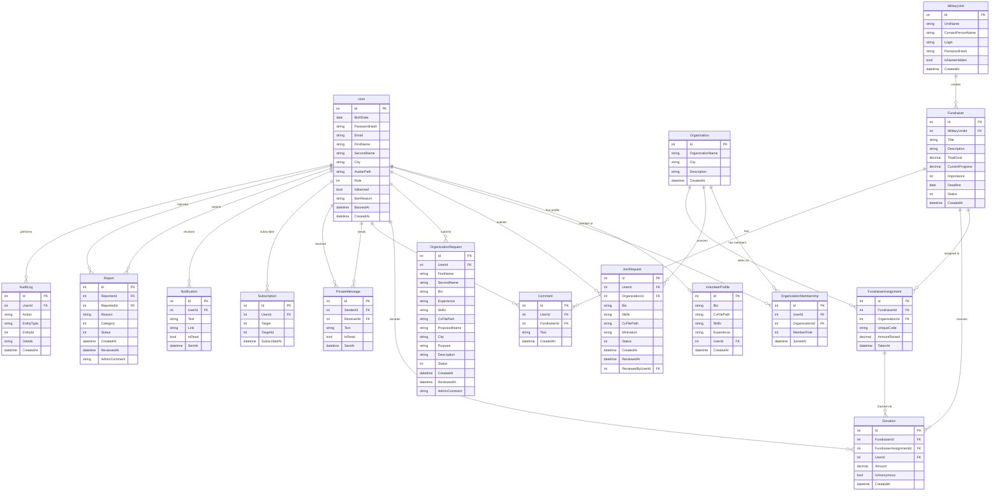

# VolunteerHQ

A platform for coordinating volunteers and military fundraising.

## ER Diagram

```mermaid
erDiagram
    User {
        int Id PK
        date BirthDate
        string PasswordHash
        string Email
        string FirstName
        string SecondName
        string City
        string AvatarPath
        int Role
        bool IsBanned
        string BanReason
        datetime BannedAt
        datetime CreatedAt
    }

    VolunteerProfile {
        int Id PK
        string Bio
        string CvFilePath
        string Skills
        string Experience
        int UserId FK
        datetime CreatedAt
    }

    Organization {
        int Id PK
        string OrganizationName
        string City
        string Description
        datetime CreatedAt
    }

    OrganizationMembership {
        int Id PK
        int UserId FK
        int OrganizationId FK
        int MemberRole
        datetime JoinedAt
    }

    JoinRequest {
        int Id PK
        int UserId FK
        int OrganizationId FK
        string Bio
        string Skills
        string CvFilePath
        string Motivation
        int Status
        datetime CreatedAt
        datetime ReviewedAt
        int ReviewedByUserId FK
    }

    OrganizationRequest {
        int Id PK
        int UserId FK
        string FirstName
        string SecondName
        string Bio
        string Experience
        string Skills
        string CvFilePath
        string ProposedName
        string City
        string Purpose
        string Description
        int Status
        datetime CreatedAt
        datetime ReviewedAt
        string AdminComment
    }

    MilitaryUnit {
        int Id PK
        string UnitName
        string ContactPersonName
        string Login
        string PasswordHash
        bool IsNameHidden
        datetime CreatedAt
    }

    Fundraiser {
        int Id PK
        int MilitaryUnitId FK
        string Title
        string Description
        decimal TotalGoal
        decimal CurrentProgress
        int Importance
        date Deadline
        int Status
        datetime CreatedAt
    }

    FundraiserAssignment {
        int Id PK
        int FundraiserId FK
        int OrganizationId FK
        string UniqueCode
        decimal AmountRaised
        datetime TakenAt
    }

    Donation {
        int Id PK
        int FundraiserId FK
        int FundraiserAssignmentId FK
        int UserId FK
        decimal Amount
        bool IsAnonymous
        datetime CreatedAt
    }

    Comment {
        int Id PK
        int UserId FK
        int FundraiserId FK
        string Text
        datetime CreatedAt
    }

    PrivateMessage {
        int Id PK
        int SenderId FK
        int ReceiverId FK
        string Text
        bool IsRead
        datetime SentAt
    }

    Subscription {
        int Id PK
        int UserId FK
        int Target
        int TargetId
        datetime SubscribedAt
    }

    Notification {
        int Id PK
        int UserId FK
        string Text
        string Link
        bool IsRead
        datetime SentAt
    }

    Report {
        int Id PK
        int ReporterId FK
        int ReportedId FK
        string Reason
        int Category
        int Status
        datetime CreatedAt
        datetime ReviewedAt
        string AdminComment
    }

    AuditLog {
        int Id PK
        int UserId FK
        string Action
        string EntityType
        int EntityId
        string Details
        datetime CreatedAt
    }

    User ||--o| VolunteerProfile : "has profile"
    User ||--o{ OrganizationMembership : "member of"
    Organization ||--o{ OrganizationMembership : "has members"
    User ||--o{ JoinRequest : "submits"
    Organization ||--o{ JoinRequest : "receives"
    User ||--o{ OrganizationRequest : "submits"
    MilitaryUnit ||--o{ Fundraiser : "creates"
    Fundraiser ||--o{ FundraiserAssignment : "assigned to"
    Organization ||--o{ FundraiserAssignment : "takes on"
    Fundraiser ||--o{ Donation : "receives"
    FundraiserAssignment ||--o{ Donation : "tracked via"
    User ||--o{ Donation : "donates"
    User ||--o{ Comment : "writes"
    Fundraiser ||--o{ Comment : "has"
    User ||--o{ PrivateMessage : "sends"
    User ||--o{ PrivateMessage : "receives"
    User ||--o{ Subscription : "subscribes"
    User ||--o{ Notification : "receives"
    User ||--o{ Report : "reports"
    User ||--o{ Report : "reported"
    User ||--o{ AuditLog : "performs"
```
